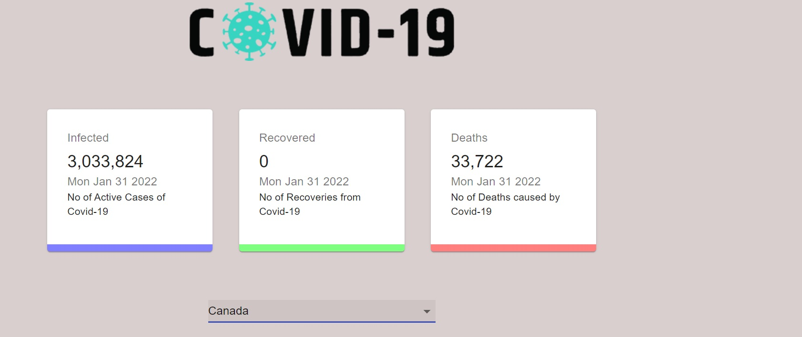

# **Corona Tracker**

The app allows us to see the daily records of covid-19 confirmed cases, recovered cases, and deaths inthe whole world as well as in a specific .

## **Final Product**

## **Setup**

- Install dependencies : npm install
- Start your client : npm start
- visit "http://localhost:3000/" in your browser

## **Project Stack**

 - React
 - Material UI 
 - Charts.js 
 - Axios
 - React-chartjs-2
 - React-countup
 - React-dom
  

